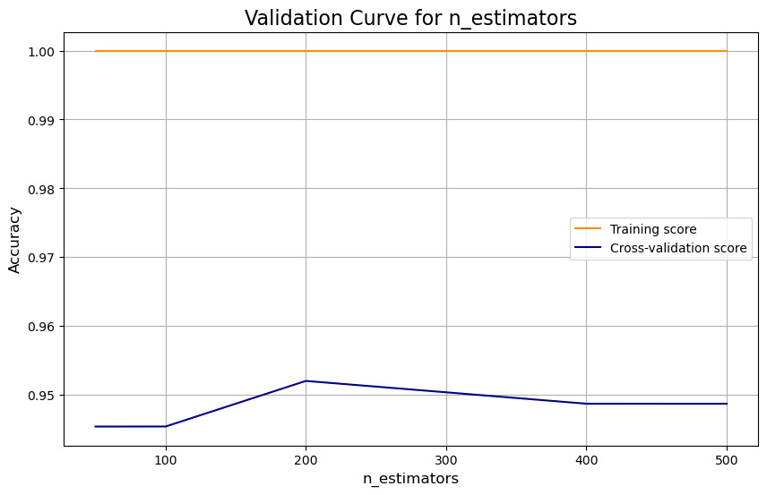

# Car Evaluation with Random Forests

This project uses a Random Forest classifier to predict car acceptability based on the UCI Car Evaluation dataset. The script preprocesses categorical data, trains a model, visualizes hyperparameter tuning, and evaluates the final model with detailed plots.

## Motivation

I wanted to apply ensemble learning to a real-world categorical dataset, focusing on visualizing the impact of hyperparameters and interpreting model results without relying on high-level libraries like `yellowbrick`.

## Features

- **Data Loading and Exploration**: Loads the dataset and displays initial info.
- **Data Visualization**: Plots the distribution of car classes.
- **Ordinal Encoding**: Converts categorical features into a numerical format.
- **Stratified Splitting**: Ensures the train/test datasets have a balanced class distribution.
- **Hyperparameter Tuning Visualization**: Plots validation curves for key hyperparameters (`n_estimators`, `max_depth`, `min_samples_split`) to show their impact on accuracy.
- **Model Evaluation**: Trains a tuned Random Forest model and evaluates it using accuracy, a classification report, and a confusion matrix.
- **Feature Importance Analysis**: Visualizes the importance of each feature in the model's predictions.
- **Analysis with Reduced Features**: Briefly explores model performance with a smaller feature set.

## Dataset

- The script automatically downloads the [UCI Car Evaluation dataset](https://archive.ics.uci.edu/ml/machine-learning-databases/car/car.data).

## Setup
-Clone the repository
-Install libraries:
```bash
pip install pandas numpy seaborn matplotlib scikit-learn
```

## Usage

```bash
python "Car-Evaluation-Random-Forest/car_evaluation_rf.py"
```

## Outputs

The script prints accuracy scores and model reports to the console and generates the following visualizations:

### Class Distribution
A bar chart showing the frequency of each car acceptability class.


### Validation Curves
Plots showing how training and cross-validation accuracy change with different hyperparameter values. This helps in choosing optimal values and understanding model bias-variance tradeoff.




### Confusion Matrix
A heatmap that visualizes the performance of the tuned model by showing how many predictions were correct and incorrect for each class.


### Feature Importance
A bar plot ranking the features by their contribution to the model's predictive power.


## What I Learned

- How to manually plot validation curves using `scikit-learn` and `matplotlib` to replace `yellowbrick`.
- The importance of stratified splitting for imbalanced datasets to ensure representative training and testing sets.
- How to interpret a confusion matrix and classification report for a multi-class classification problem.
- That `safety` and `persons` are the most critical factors in determining car acceptability in this dataset.

## Challenges

- Replacing the convenience of `yellowbrick` with more fundamental `matplotlib` and `scikit-learn` functions required a bit more boilerplate code but offered greater control over the visualizations.
- Selecting appropriate ranges for hyperparameter tuning to create informative validation curves.

## License

MIT
